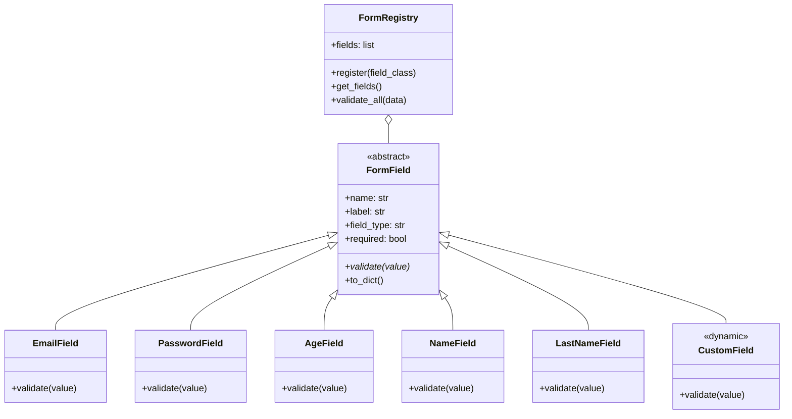

# Diseño del Proyecto: Formulario de Registro Extensible

Este documento detalla la arquitectura, el diseño de patrones y la pila de tecnologías propuestas para la aplicación de registro de usuarios utilizando **Python (Flask)** y **PostgreSQL**.

---

## 1. Pila de Tecnologías Propuestas (Sugerencias)

Para implementar este sistema de manera robusta, limpia y moderna, utilizaremos las siguientes tecnologías:

| Tecnología | Rol / Propósito | Justificación |
| :--- | :--- | :--- |
| **Python (Flask)** | Servidor Backend (API) | Framework ligero, flexible y rápido de configurar para aplicaciones pequeñas/medianas. |
| **PostgreSQL** | Base de Datos Relacional | Base de datos robusta con soporte nativo para tipo de datos `JSONB`, clave para la extensibilidad sin alterar el esquema físico. |
| **psycopg2-binary** | Conector de Base de Datos | Driver estándar de Python para interactuar con PostgreSQL de manera eficiente. |
| **Werkzeug (Security)** | Seguridad / Hasheo | Biblioteca integrada en Flask para realizar hash seguro de contraseñas mediante PBKDF2/SHA256. |
| **HTML5 / CSS3 / JavaScript (Fetch API)** | Frontend (UI) | Interfaz responsiva, moderna y con micro-interacciones. Validaciones en tiempo real en cliente y envío asíncrono (AJAX). |
| **Docker / Docker Compose** *(Opcional)* | Entorno de Base de Datos | Permite levantar una instancia local de PostgreSQL lista para usar con un solo comando. |

---

## 2. Arquitectura de Extensibilidad (Principio Abierto/Cerrado)

Para cumplir con el requerimiento de **"fácil de ampliar sin modificar las clases o módulos del código"**, utilizaremos el **Patrón Strategy** combinado con **Auto-registro/Factory**:

### Funcionamiento:
1. **Clase Base (`FormField`)**: Define la interfaz común para todos los campos (nombre, etiqueta, tipo HTML, reglas de validación).
2. **Registro Automático (`FormRegistry`)**: Una clase que recopila automáticamente todas las subclases que heredan de `FormField`.
3. **Módulo de Campos Core (`fields/core_fields.py`)**: Contiene los campos solicitados originalmente (Email, Nombre, Apellido, Edad, Contraseña).
4. **Módulo de Campos Personalizados (`fields/custom_fields.py`)**: Para añadir nuevos campos en el futuro, **solo se debe crear una nueva clase en este archivo que herede de `FormField`**. El sistema la detectará, validará y mostrará en la interfaz automáticamente.

---

## 3. Modelo de Base de Datos (1 sola tabla)

Usaremos una tabla en PostgreSQL con soporte para datos dinámicos mediante una columna `JSONB` de PostgreSQL. Esto permite guardar campos adicionales sin alterar la estructura física de la tabla.

### Estructura de la Tabla `users`:

| Columna | Tipo de Datos | Restricciones | Descripción |
| :--- | :--- | :--- | :--- |
| `id` | `SERIAL` | `PRIMARY KEY` | Identificador único de usuario. |
| `email` | `VARCHAR(255)` | `UNIQUE`, `NOT NULL` | Correo electrónico principal. |
| `name` | `VARCHAR(100)` | `NOT NULL` | Nombre. |
| `last_name` | `VARCHAR(100)` | `NOT NULL` | Apellido. |
| `age` | `INTEGER` | `NOT NULL` | Edad del usuario. |
| `password` | `VARCHAR(255)` | `NOT NULL` | Hash seguro de la contraseña. |
| `extra_data` | `JSONB` | `DEFAULT '{}'` | Almacena cualquier campo dinámico adicional (ej. teléfono, género, dirección) en formato JSON. |
| `created_at` | `TIMESTAMP` | `DEFAULT CURRENT_TIMESTAMP` | Fecha de registro. |

---

## 4. Plan de Implementación

1. **Paso 1**: Crear estructura de carpetas y configurar entorno.
2. **Paso 2**: Escribir `docker-compose.yml` para levantar PostgreSQL de forma sencilla.
3. **Paso 3**: Crear el core de validación y campos (`fields/base.py`, `fields/core.py`, `fields/custom.py`).
4. **Paso 4**: Implementar el controlador de Base de Datos (`database.py`).
5. **Paso 5**: Crear el servidor Flask (`app.py`) con endpoints para renderizar el formulario dinámico y procesar el registro.
6. **Paso 6**: Desarrollar la Interfaz de Usuario (HTML, CSS con diseño premium, JS para interactividad y validaciones dinámicas).
7. **Paso 7**: Pruebas y demostración de cómo extender el formulario añadiendo un nuevo campo personalizado.
